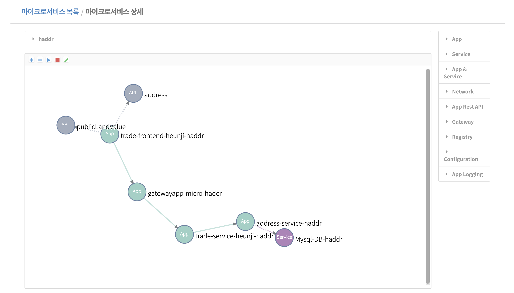

## 공동주택 실거래가 대비 공시지가 비율 조회 애플리케이션 배포
해당 샘플 앱은 MsXpert Studio를 활용을 목적으로 만들었으며 API Gateway, Eureka, Config Server 등을 직접 설정하지 않아도 Studio를 통해 네이티브 애플리케이션을 만들 수 있습니다. 또한, Cloudfoundry CLI를 통해 해당 마이크로서비스 샘플 앱을 배포할 수 있습니다.


## Table of Contents
1. [서비스 소개](#Introduction)
2. [서비스 설계](#Architecture) 
3. [프론트엔드 API 문서 제공](#프론트엔드-api-문서-제공)
3. [배포 전 준비사항](#Preparations)
4. [앱 배포](#Application-Deploy)
5. [MsXpert Nipa 활용](#MsXpert-Studio-접속)


## Introduction
해당 마이크로서비스는  **주소 서비스** 및 **공동주택 가격정보 조회 서비스**  REST API를 통해 당해년도 분기별 실거래가 대비 공시지가 비율을 조회하는 서비스입니다.


## Architecture
해당 마이크로서비스는 Frontend, Gateway, Backend, Config Server, Registry 등 최소 5개의 앱으로 구성되어 있으며, 공동주택 가격정보 조회, 주소 조회 등의 마이크로서비스 Rest API를 요청하고 있습니다.  마이크로서비스 Studio를 사용한 앱 간의 관계는 다음과 같습니다.


## 프론트엔드 API 문서 제공
이 서비스는 MsXpert Studio를 이용하여 배포된 마이크로서비스의 Frontend 애플리케이션 API 문서를 조회할 수 있습니다.


- /api/trade/condition/list : 당해연도 및 분기, 행정구역, 조건 등에 해당하는 아파트 실거래가 대비 공시지가 비율 데이터를 반환합니다.
- /api/trade/list/{rnMgtSn} : 당해연도 및 분기, 아파트 키워드 조건에 해당하는 실거래가 대비 공시지가 비율 데이터를 반환합니다.


## Preparations

1. [OpenDataMarket 홈페이지](#http://182.252.131.40:3000) 내 OpenData 메뉴에서 **아파트매매 실거래 상세 자료** API를 활용 신청합니다.

  
   
2. 마이페이지에서 **나의 인증키**를 복사합니다.
  

3. aptTrade-service/src/main/resources/application.properties 수정
  
   ````
   #공공데이터 포털 주소 API
   opendata.api.apt.trade.uri: http://182.252.131.40:9000/apiservice/4357
   opendata.api.key: ##여기에 키 입력
   ````
      
4. CF 또는 [PaaS-TA](#http://paas-ta.kr) 설치
5.  **[CF  CLI](#https://github.com/cloudfoundry/cli/releases)** 설치 
       


## Application Deploy
1. aptTrade-frontend, aptTrade-service 각각 프로젝트를 빌드합니다.

    ````
    $ cd aptTrade-frontend 
    $ mvn clean package 
    $ cd ../aptTrade-service
    $ mvn clean package
    ````


2.  CF CLI를 통해 조직 및 영역을 생성합니다. [PaaS-TA 포털을 활용중일 경우 포털을 통해 조직 및 영역을 생성할 수 있습니다.] 
    PaaS-TA 포털에 배포할 조직 및 영역과 MsXpert Studio에 배포할 조직 및 영역을 각각 생성합니다.

      ````
      $ cf create-org user1-paasta
      $ cf create-space -o user1-paasta -s trade-paasta-space
      $ cf create-org user1-msa
      $ cf create-space -o user1-msa -s trade-msa-space
      ```` 
  

3. MsXpert Studio에서 user1-msa	조직에 앱을 copy하여 배포하기위해 user1-paasta 조직에 위 샘플앱(frontend, backend) 을  CF CLI을 통해 push합니다.

    ````
    $ cd aptTrade-frontend
    $ cf push --no-start ##manifest가 존재하는지 확인 
    $ cd ../aptTrade-service
    $ cf push --no-start
    ````

## MsXpert Studio 접속

Paas-TA 계정을 가지고 MsXpert Studio에 접속하여  아래 이미지와 같이 user1-paasta 조직에 배포한 frontend, backend 앱을 마우스로 드래그하여 마이크로서비스를 설계할 수 있습니다.

  

    
